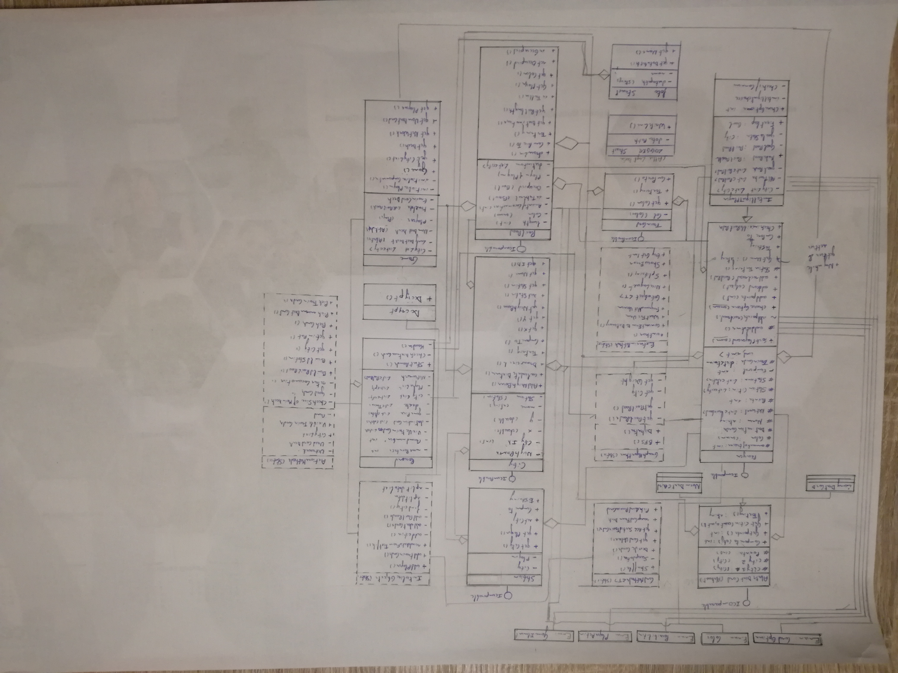

# Ticket to Ride
Ik raad u eerst aan om eens door de handleiding te bladeren zodat u zich een algemeen beeld kan vormen over het spel.

Zoals u ziet schreeuwt dit spel om geïmplementeerd te worden met grafen.
Om te zoeken of een speler één van zijn destination cards vervolledigd heeft wordt breadth first search geïmplementeerd.
De belangrijkste manier om punten te verzamelen is door routes die op de destinationcards staan te vervolledigen. 
Onze computer houdt dus rekening met de routes die er zijn. 
Via het algoritme van Dijkstra wordt het kortste pad gezocht tussen 2 steden. 
Het gewicht op elke edge wordt bepaald door een empyrische combinatie van de huidige kaarten, 
de lengte en het type spoor en als laatste hoeveel punten hij mogelijk met deze gelegde route kan verkrijgen.

Uiteindelijk zal de computer zich dan focussen om deze route te bouwen. 
Indien hij geen destinationcards meer over heeft zal hij pas een destinationcard trekken.
Aangezien dit spel zeer veel unieke data bevat, alle unieke steden, de buren en coördinaten van de steden,
de sporen tussen de steden en de kaarten, wordt deze data ingeladen via een (geëncrypteerde) textfile.
(bij het form worden ook foto-objecten ingeladen  bij het opstarten)
Als de data ingeladen is kunnen de spelers aangemaakt worden, deze worden via een nieuwe form aan de console gevraagd. 

Er moeten minimum 2 spelers zijn en minstens 1 daarvan moet een menselijke speler zijn, (u kan dit aanpassen in de code indien u robot vs robot wil zien spelen). 
De bottleneck om dit programma te maken was voor mij de controle die nodig was bij elke mogelijkheid die de speler heeft bij de ronde(een station plaatsen, 
een kaart trekken en een spoor bezetten). Ik had niet verwacht dat dit zoveel werk zou zijn en zat al snel aan een goede 600 lijntjes. 
Ik heb geen mogelijkheid meer gegeven om het spel op te slaan en dus kan ik ook geen bestaand spel openen. 
Indien ik opnieuw zou beginnen met dit te maken zou ik zeker een testgeörienteerde programmeerstijl gebruiken
 met testklassen (test unit object). Aangezien ik met zoveel unieke data zat had ik af en toe wat data dubbel 
doorgegeven en waren er dus moeilijk traceerbare fouten. (hier heb ik zeker 4/5 uur aan ‘verspild’). 

de functie van de tunnels is niet geïmplementeerd en er wordt gespeeld tot er iemand meer dan 50 punten heeft behaald.
De 'virtuele stationnen' zijn wel geïmplementeerd zodat de menselijke spelers een goede evenaring ervaren van het echte spel. 

Het UML moet ik ook nog maken, maar ik ben er nog niet helemaal uit hoe ik rond de 20 klassen mooi op een blad moet krijgen. 

## UML

 

Veel speelplezier
Jonas Van Der Donckt
